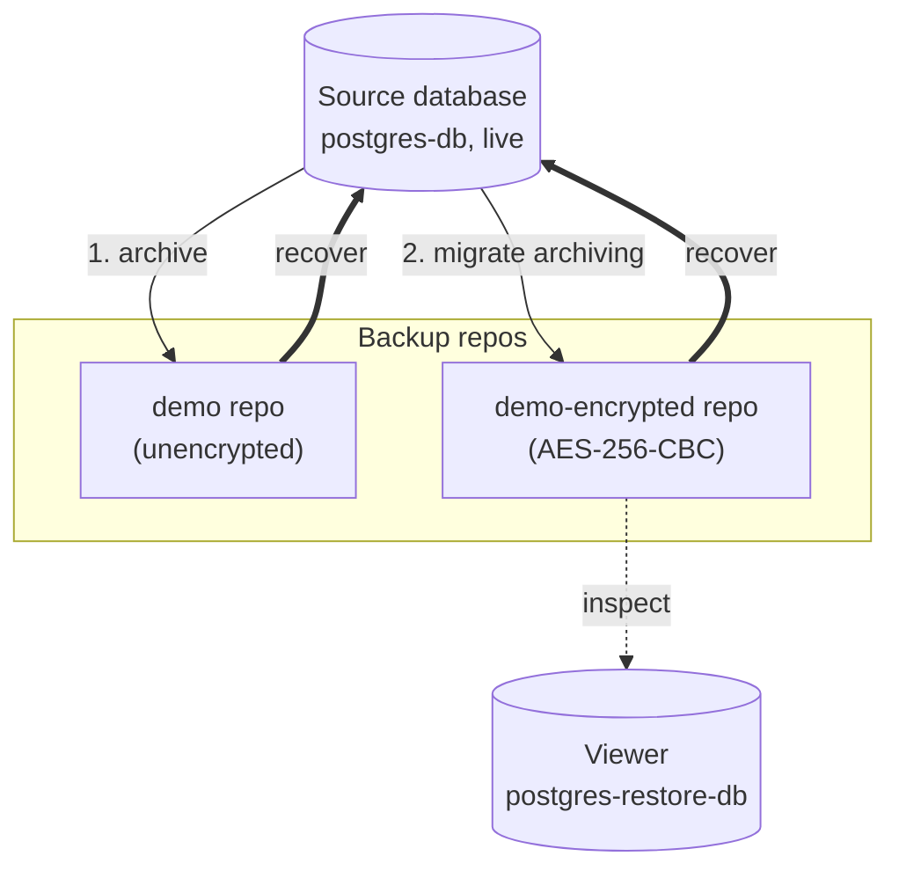
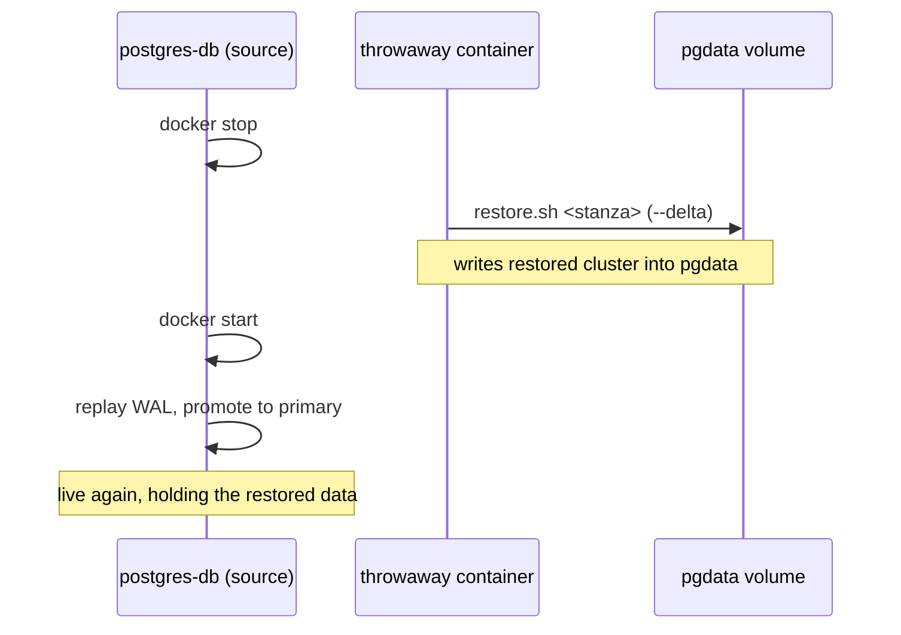

# PostgreSQL + pgBackRest encrypted backup sandbox

[](https://github.com/omerosaienni/pg-encrypted-backups/actions/workflows/demo.yml)
[](LICENSE.md)

A self-contained sandbox for two things [pgBackRest](https://pgbackrest.org/)
does that production databases eventually need:

1. **Migrating** a live database's archiving from an unencrypted repo to an
   encrypted (AES-256-CBC) one, without a restart.
2. **Recovering** from a backup — rolling the live source database back onto an
   earlier backup, which is what you actually do in a disaster.

It runs on local disk out of the box, and on Google Cloud Storage with Terraform.
Everything is driven by a Makefile; `make demo` walks the whole story end to end.

## The four-stanza model

A pgBackRest *stanza* is a named (database, repo) pairing. This sandbox defines
four, each pinned to its own repo so a local operation never reaches for GCS and
an unencrypted operation never touches the encrypted repo:

| Stanza | Repo | Encrypted |
|--------|------|-----------|
| `demo` | local disk | no |
| `demo-encrypted` | local disk | yes (AES-256-CBC) |
| `demo-gcp` | GCS | no |
| `demo-gcp-encrypted` | GCS | yes (AES-256-CBC) |

The migration is nothing more than **switching `archive_command`** from the
unencrypted stanza to the encrypted one. From that point new WAL and backups are
encrypted; the old stanza stays around so you can still restore pre-migration
backups.

The demo uses the local pair (`demo` / `demo-encrypted`). The GCS path runs the
identical story on the `demo-gcp` pair.

### The flow the demo runs



Two distinct uses of a backup, and the distinction is the whole point:

- **Inspect (dotted)** — restore a backup into the *viewer* container to see what
  it holds. The source is never touched. This is a safe place to investigate.
- **Recover (bold)** — restore a backup back onto the *source* itself, taking it
  down and bringing it back up on the restored data. This is real recovery; it
  overwrites the live database.

### The rollback, in detail

Recovering onto the source can't be done from inside the source container —
PostgreSQL is PID 1 there, and a restore needs the data directory offline. So the
demo stops the container, restores into its `pgdata` volume from a throwaway
container, and starts it again. It boots on the restored data and promotes to a
writable primary.



## Two containers

- **`postgres-db`** — the live source. It archives WAL, takes backups, and is the
  target you roll back during recovery. Its cluster lives in the `pgdata` volume.
- **`postgres-restore-db`** — the **viewer**. It boots idle (`tail -f`); you
  restore a backup into it and start it to inspect what was restored. It shares
  the repo volume with the source but has **no `pgdata` volume** — the restore
  writes into the container's own writable layer, so recreating it discards the
  restore. Inspection only; it is never the recovery target.

## Quick start

**Prerequisites:** Docker and GNU Make. (The GCS path also needs Terraform and a
`gcloud` login — see [Backing up to GCS](#backing-up-to-gcs).)

```bash
make build      # build the image (no GCS provisioning)
make run        # start the source and viewer containers
make demo       # run the full migration + recovery story on local disk
```

## What the demo proves

`make demo` starts from a clean state, then walks one continuous story:

1. The live database is taking orders, archiving WAL to the **`demo`**
   (unencrypted) stanza. It takes a **full** backup there.
2. More orders arrive. The demo then **migrates** — points `archive_command` at
   the **`demo-encrypted`** stanza live, with `ALTER SYSTEM` + `pg_reload_conf()`,
   no restart. More orders, a **full** encrypted backup, then an **incremental**
   (only the changes since the full).
3. **Inspect** the latest encrypted backup in the viewer: stop the viewer's
   PostgreSQL, restore `demo-encrypted` into it, start it, print the orders. The
   source is untouched — this is investigation, not recovery.
4. **Recover onto the source.** First roll the source back to the **`demo`**
   (pre-migration, unencrypted) backup; the source comes back up holding the
   smaller, older order set. Then roll it back to the **`demo-encrypted`** backup
   instead; it comes back up holding the latest full + incremental data.

The payoff is step 4: the same live database, taken down and brought back on a
chosen backup from either stanza.

Inspect either database directly while it's up:

```bash
make psql-db        # the live source
make psql-restore   # the viewer (after a restore + start)
```

## Backing up to GCS

> **Use a dedicated, disposable bucket.** Terraform creates the bucket with
> `force_destroy = false`, so `make destroy` can only delete it once it's empty.
> `make clean` empties the demo workspace first, so a teardown of the demo's own
> bucket succeeds — but if you point `bucket_name` at a bucket that already holds
> other objects, `terraform destroy` refuses to delete it rather than wiping your
> data. Still, use a throwaway bucket: this guard stops an accident, not intent.

Set your project and a globally-unique bucket name (copy the example first):

```bash
cp terraform/terraform.tfvars.example terraform/terraform.tfvars
# edit terraform/terraform.tfvars
```

Authenticate with `gcloud auth application-default login`, then:

```bash
make build-gcs  # terraform apply (bucket + service account) + build
make run
make demo-gcs   # same story on the GCS stanzas (demo-gcp / demo-gcp-encrypted)
```

Terraform renders the GCS pgBackRest config (bucket baked in at apply time) into
the gitignored `docker/config/gcp/`, and writes the service-account key into
`secrets/`. Backups land under `/demo-workspace` in the bucket. The local config
under `docker/config/local/` is committed and static. The run scripts bind-mount
whichever config matches the mode — nothing GCS-specific is baked into the image,
so the config and the bucket it names can't drift.

> Terraform creates a service-account **key**. Some orgs disable this
> (`constraints/iam.disableServiceAccountKeyCreation`); if so, `terraform apply`
> fails creating the key — use Workload Identity instead for a real deployment.

## Running backups and restores by hand

The container scripts are on the `PATH`. The **stanza name decides** local vs
GCS and encrypted vs not.

> Hand-running the GCS stanzas needs the containers started against the GCS
> config: `TARGET=gcp make run` (so the run scripts mount `docker/config/gcp/`).
> The plain `make run` mounts the local config and only knows the local stanzas.

Take backups on the source:

```bash
make exec-db
backup.sh demo-encrypted              # full backup (default)
backup.sh demo-encrypted incr         # incremental
exit
```

Inspect a backup in the viewer (look without touching production):

```bash
make exec-restore
stop-viewer.sh                        # a restore needs PostgreSQL stopped
restore.sh demo-encrypted             # delta-restore the latest backup
start-viewer.sh                       # bring it up to inspect
exit
```

To recover onto the source instead, see what `restore_onto_source` does in
[scripts/demo.sh](scripts/demo.sh): stop `postgres-db`, restore into its `pgdata`
volume from a throwaway container, start it again.

## Makefile commands

| Command | Description |
|---------|-------------|
| `make build` / `make build-gcs` | build the image (local / with GCS provisioning) |
| `make run` / `run-db` / `run-restore` | start the containers |
| `make demo` / `make demo-gcs` | run the full story (local / GCS) |
| `make exec-db` / `exec-restore` | shell into a container |
| `make psql-db` / `psql-restore` | open `psql` on the demo data |
| `make stop` | stop and remove the containers |
| `make delete` | stop the containers and delete the image |
| `make clean` | stop, remove the volumes (and empty the GCS bucket if configured) |
| `make destroy` | full teardown: clean + delete image + destroy GCS infra |

## How it works

### Config split

- `docker/config/local/` — committed, static config (`pgbackrest.conf`,
  `archive.conf`). The local stanzas and their `repo1-path` never change, so they
  live in the repo.
- `docker/config/gcp/` — the **same two files, generated by Terraform** with the
  bucket name baked in at apply time. Gitignored; only exists after `make
  build-gcs`.
- `docker/config/postgresql.conf.sample` — base Postgres settings (applied at initdb).
- `docker/scripts/pgbackrest/` — `backup.sh`, `restore.sh`,
  `start-viewer.sh`, `stop-viewer.sh`.
- `docker/scripts/init/init-user-db.sh` — seeds the role, database and sample
  `orders` data.
- `scripts/` — host-side orchestration the Makefile drives (`demo.sh`,
  `run-database.sh`, `run-restore.sh`, …).

`archive.conf` is mounted as a `conf.d` drop-in rather than passed with `-c`, so
the demo's migration step (`ALTER SYSTEM SET archive_command`) can override it
live.

### Named volumes

Data lives in named Docker volumes, so there is nothing to pre-create:

- `pgdata` — the source database cluster (also the recovery target).
- `pgbackrest-repo` — the local pgBackRest repo, **shared** by both containers so
  the viewer can restore the source's backups.

The GCS config sets `repo1-bundle` and `process-max` to make GCS backups fast
(many tiny WAL/cluster files become a few bundled uploads, run in parallel); the
local posix repo doesn't need either. The config sets `repo1-retention-full=6`,
but the demo takes only a couple of backups per stanza, so retention/expiry is
configured but never actually exercised.

## Footguns

- **`make destroy` is destructive and unprompted.** It runs `clean` (removes the
  volumes, empties the GCS workspace) and `terraform destroy` (deletes the bucket).
  No confirmation. The bucket is created with `force_destroy = false`, so destroy
  only deletes it once empty — `clean` empties the demo workspace, but a bucket
  holding other objects is refused rather than wiped. Use a throwaway bucket.
- **The GCS path creates real resources.** A bucket, a service account, and a key
  cost a small amount and incur GCS request/storage charges while they exist.
  Clean up with `make destroy` when done.
- **Change every demo credential before any non-sandbox use** (below).

## Demo credentials

This is a sandbox; the credentials are demo placeholders:

- Postgres superuser password (`mysecretpassword`, [scripts/run-database.sh](scripts/run-database.sh))
- Demo role `myuser` / `myuserpassword` ([docker/scripts/init/init-user-db.sh](docker/scripts/init/init-user-db.sh))
- pgBackRest encryption passphrase `some-cipher-pass` ([docker/config/local/pgbackrest.conf](docker/config/local/pgbackrest.conf) and the Terraform GCS template)

**Change all of these before any non-sandbox use.** This sandbox ships no custom
`pg_hba.conf` — host authentication is whatever the official PostgreSQL image
generates. What actually limits exposure here is that the mapped ports bind to
`127.0.0.1` only ([scripts/run-database.sh](scripts/run-database.sh)), so the
databases are reachable from the host but not the wider network. Configure
authentication explicitly for any real deployment.

## Built With

- [Docker](https://www.docker.com/) — container platform
- [PostgreSQL](https://www.postgresql.org/) — the database
- [pgBackRest](https://pgbackrest.org/) — backup and restore
- [Terraform](https://www.terraform.io/) — GCS infrastructure

## License

MIT — see [LICENSE.md](LICENSE.md).
